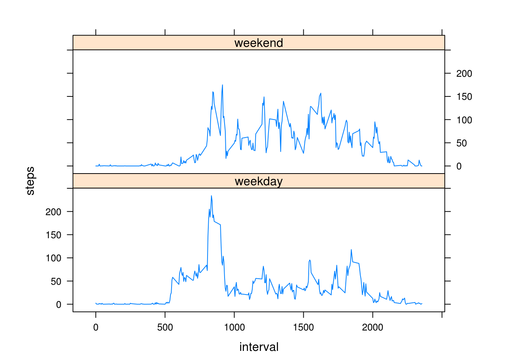

```{r}
##Section 1:Loading and preprocessing the data
#1a: Set directory
getwd()
setwd("~/Desktop/cousera/Reproducible Research/")
#1b:Loading and reading file
data <- read.csv("~/Desktop/cousera/Reproducible Research/activity.csv")
summary(data)
str(data)
#1c:change date
data$date <- as.Date(data$date)
#1d: find missing value NA
sum(is.na(data$steps))

##Section 2:What is mean total number of steps taken per day?
#2a: Total number of steps taken
totalSteps <- aggregate(steps~date,data=data,sum, na.rm = TRUE)
hist(totalSteps$steps, main = paste("Total Steps Each Day"), col="green", xlab="Number of Steps")
```

```{r}
#2b: find Average of Steps
totalStepsmean <- mean(totalSteps$steps)
#2c: find Median of steps
totalStepsmedian <- median(totalSteps$steps)

##Section 3:What is the average daily activity pattern?
#3a:Calculate average steps for each interval for all days.
steps_by_interval <- aggregate(steps ~ interval, data, mean)
#3b:Plot the Average Number Steps per Day by Interval.
plot(steps_by_interval$interval,steps_by_interval$steps, type="l", xlab="Interval", ylab="Number of Steps",main="Average Number of Steps per Day by Interval")
#3c:Find interval with most average steps.
max_interval <- steps_by_interval[which.max(steps_by_interval$steps),1]
print(max_interval)
```


```{r}
##Section 4:Imputing missing values
incomplete <- sum(!complete.cases(data))
print(incomplete)
imputed_data <- transform(data, steps = ifelse(is.na(data$steps), steps_by_interval$steps[match(data$interval, steps_by_interval$interval)], data$steps))
head(imputed_data,5)
steps_by_day_i <- aggregate(steps ~ date, imputed_data, sum)
#Create Histogram to show difference. 
hist(steps_by_day_i$steps, main = paste("Total Steps Each Day"), col="blue", xlab="Number of Steps")
hist(totalSteps$steps, main = paste("Total Steps Each Day"), col="yellow", xlab="Number of Steps", add=T)
legend("right", c("Imputed", "Non-imputed"), col=c("blue", "yellow"), lwd=10)
# find avrage of imputed steps
totalStepsmean.i <- mean(steps_by_day_i$steps)
# find median of imputed steps
totalStepsmedian.i <- median(steps_by_day_i$steps)
mean_diff <- totalStepsmean.i - totalStepsmean
med_diff <- totalStepsmedian.i - totalStepsmedian
total_diff <- sum(steps_by_day_i$steps) - sum(totalSteps$steps)
print(total_diff)
```


```{r}
##Section 5:Are there differences in activity patterns between weekdays and weekends?

data$dayname <- weekdays(data$date)
data$weekend <- as.factor(ifelse(data$dayname == "Sabtu" |
                                         data$dayname == "Ahad", "weekend", "weekday"))
library(lattice)
plotdata <- aggregate(steps ~ interval + weekend,data, mean)
xyplot(steps ~ interval | factor(weekend), data=plotdata, aspect=1/3, type="l")

```

